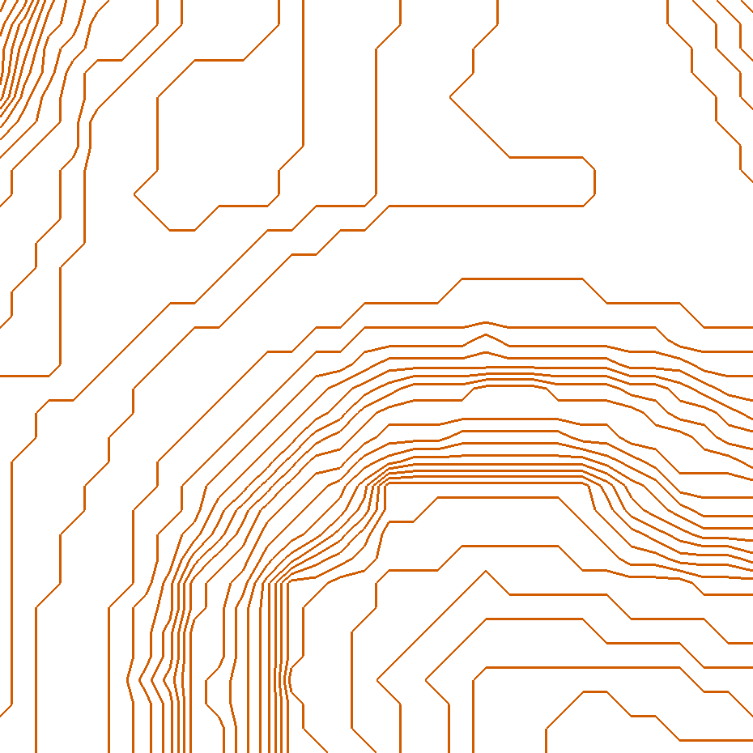
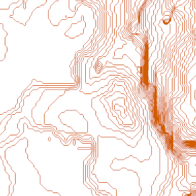

# TopoMC

TopoMC is a python project that converts minecraft chunks into a topographical map.

## How it Works

Creating the topo map from the chunks, inside the chosen bounding co-ordinates, is a 6 step process:

### 1. Reading Chunks
Firstly the raw chunk data needs to be read and processed. This is done by opening the minecraft world save directory and reading the region files (`.mca`) for a world save. The data in these files is processed by the **anvil-parser** python library. This may change in the future.

### 2. Creating a Heightmap
Once the region data is decoded chunks can be iterated through. The chunk is split up into 64 columns of depth 256. A loop iterates through the column until it locates a "ground block" - these are blocks are assigned in `settings.yaml` that are considered "ground level" when iterating from above.

To make this process faster and more efficient, the loop can take advantage of chunk-format heightmaps. To improve minecraft's performance, every chunk file contains precomputed heightmap data which contains info such as the first motion-blocking minecraft block from above. By starting the loop from the height precalculated by these heightmaps instead of y-256 every time a column is searched, efficiency is greatly improved.

After height-points for every ground block have been gathered they are stored in a class containing a 2d list.

### 3. Marching Squares Algorithm
After a heightmap has been created, it needs to be converted into coordinate data which is later used to draw lines that split up the height differences of the heightmap - or contours. To do this the heightmap is transformed into cells, with a height point in each corner. The difference between the corners is then used to decide where to place the points for the line to be drawn. This is called the [marching squares algorithm](https://en.wikipedia.org/wiki/Marching_squares). This creates cells, each with a line (or absence thereof) inside.

### 4. Vectorization
In order for these pixel lines (pixlines) to be smoothed later on, they need to be vectorised so that this line data is stored as a series of coordinates with a start and end, rather than a single pixel with a line in it. To do this, I developed a [tracing algorithm](./topomc/vectorize.py) that finds a pixline, and explores outwards from the line until the edge of the bounding co-ordinates is found, or the line loops back on itself. After this the explored pixels are logged in a bitmap, and the lines are joined. At the end of this process the data is transformed into heightplanes, each which contain these lines.

### 5. Smoothing
*This step is still in progress.*

### 6. Drawing
In order to draw the iso-lines, the python library **Pyglet**, which runs on openGL, is used. This is very likely to change in th future.

Isolines are drawn by simply converting the point co-ordinates to canvas x and y values, and multiplying by the window scale.

## Installation and running
### Installation

1. Firstly, make sure all [dependencies](Pipfile) are installed.
Using the included virtual environment (pipenv) is highly reccommended as all the default dependencies are already set up.
2. Clone this repository
3. Specify where your minecraft save files are located. This changes from system to system so it needs to be configured in the repository's [settings.yaml](topomc/common/settings.yml) file, next to the option `path_to_saves`. **This needs to be an abslute path**.
  * On Windows, the default path is `%appdata%\.minecraft\saves\`
  * On Linux, the default path is `~/.minecraft/saves/`
  * On Mac, the default path is `~/Library/Application Support/minecraft/saves/`
4. Optionally, other settings in [settings.yaml](topomc/common/settings.yml) can be changed as well, but testing has only been done on default settings.

### Running
This script needs Python **3.7** or higher to run.

Firstly, specify the world you would like to run the script on in [settings.yaml](topomc/common/settings.yml).

The arguments to run the script are as follows:
`python` `topomc` `x1` `z1` `x2` `z2`
* (`x1`, `z1`) - Top left chunk limit
* (`x2`, `z2`) - Bottom right chunk limit

* All chunks within these arguments will be bounded and shown on the map.
* Both co-ordinates are inclusive.
* Make sure the command is run in the root derectory of the project.

#### The following optional arguments can be added to the end of the command:
* `world` - overrides the world setting in [settings.yaml](topomc/common/settings.yml)
* `contour_interval` - overrides the contour_interval setting in [settings.yaml](topomc/common/settings.yml)
* `contour_offset` - overrides the contour_offset setting in [settings.yaml](topomc/common/settings.yml)
