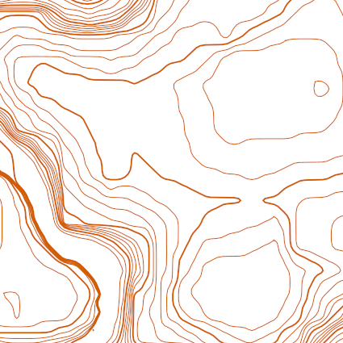
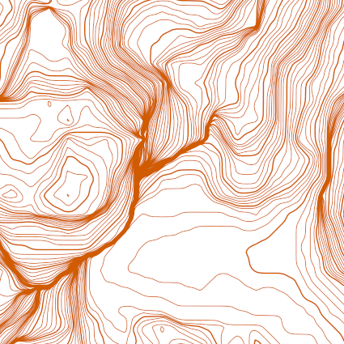

# TopoMC
 

TopoMC is a python project that converts minecraft chunks into a topographical map. **Please note that at the moment this project only works for 1.15 and below due to Mojang changing the way that chunk heightmaps are encoded.** Feel free to create a PR to implement a new decoding algorithm that can handle 1.16 chunks

# TODO LIST:
 - [ ] Support 1.16
 - [x] Create taglines
 - [ ] Implement index contours
 - [ ] Setting to enable / disable taglines
 - [ ] Quick render
 - [ ] Improve tagline algorithm

## How it Works

Creating the topo map from the chunks, inside the chosen bounding co-ordinates, is a 5 step process:

### 1. Reading Chunks
Firstly the raw chunk data needs to be read and processed. This is done by opening the minecraft world save directory and reading the region files (`.mca`) for a world save. The data in these files is processed by the **anvil-parser** python library. This may change in the future.

### 2. Creating a Heightmap
Once the region data is decoded chunks can be iterated through. The chunk is split up into 64 columns of depth 256. A loop iterates through the column until it locates a "ground block" - these are blocks are assigned in `settings.yml` that are considered "ground level" when iterating from above.

To make this process faster and more efficient, the loop can take advantage of chunk-format heightmaps. To improve minecraft's performance, every chunk file contains precomputed heightmap data which contains info such as the first motion-blocking minecraft block from above. By starting the loop from the height precalculated by these heightmaps instead of y-256 every time a column is searched, efficiency is greatly improved.

### 3. Marching Squares Algorithm
After a heightmap has been created, it needs to be converted into coordinate data which is later used to draw lines that split up the height differences of the heightmap - or contours. To do this the heightmap is transformed into cells, with a height point in each corner. The difference between the corners is then used to decide where to place the points for the line to be drawn. This is called the [marching squares algorithm](https://en.wikipedia.org/wiki/Marching_squares). I have created a more advanced "wandering marching squares" [marching_squares.py](topomc/algorithms/marching_squares.py) algorithm which also creates vector lines in the process

### 4. Generalization
In order to smooth the isolines, the 1d guassian filter function is used from the `scipy.ndimage` library. This is an algorithm that creates many points in order to create a smooth line.

The iso-line smoothing can be turned off in [settings.yml](settings.yml).

### 5. Drawing
Pyplot from matplotlib is used to render the lines.

## Installation and running
### Installation

1.    Firstly, make sure all [dependencies](Pipfile) are installed.
Using the included virtual environment (pipenv) is highly reccommended as all the default dependencies are already set up.

2.    Clone this repository

3.    Specify where your minecraft save files are located. This changes from system to system so it needs to be configured in the repository's [settings.yml](topomc/common/settings.yml) file, next to the option `path_to_saves`. **This needs to be an abslute path**.
 *  On Linux, the default path is `~/.minecraft/saves/`
 *  On Mac, the default path is `~/Library/Application Support/minecraft/saves/`
 *  On Windows, the default path is `%appdata%\.minecraft\saves\`. Please note that if the path starts with a % symbol, it will need to be enclosed in quotes in [settings.yml](settings.yml).

4.    Optionally, other settings in [settings.yml](settings.yml) can be changed as well, but testing has only been done on default settings.

### Running
This script needs Python **3.8** or higher to run.

Firstly, specify the world you would like to run the script on in [settings.yml](settings.yml).

The arguments to run the script are as follows:
`python` `topomc` `x1` `z1` `x2` `z2`
*   (`x1`, `z1`) - Top left chunk limit
*   (`x2`, `z2`) - Bottom right chunk limit
*   All chunks within these arguments will be bounded and shown on the map.
*   Both co-ordinates are inclusive.
*   Make sure the command is run in the root derectory of the project.

The following optional arguments can be added to the end of the command:
*   `-D, --debug ` `x, z` - Opens a preview in debug mode for chunk `(x, z)`
*   `-w, --world` - overrides the world setting in [settings.yml](settings.yml).
*   `-I` - overrides the Interval setting in [settings.yml](settings.yml) under contours.

By default, the script will output a PDF file of the map at the scale defined in [settings.yml](settings.yml). As well as this, a preview window will appear. If file output is not necessary, the setting for output file can be left blank and the preview window by itself can be used.
