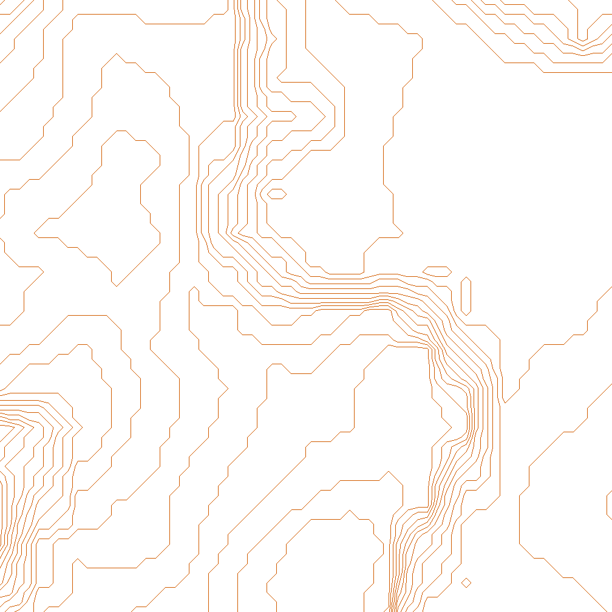

# TopoMC



TopoMC combines the ecosystem of Python libraries for Minecraft and the extensive spatial support of R to create beautiful topographical maps of your Minecraft worlds. TopoMC supports all Minecraft versions from 1.9 up to the current release (1.20.1), excluding 1.18-based versions (for now).

## How to Use

### Requirements

- Python >= 3.9: check with `python3 --version`
  - [pipenv](https://pipenv.pypa.io/en/latest/installation/#installing-pipenv): check with `pipenv --version`
- R >= 4.1.0: check with `R --version`
  - [renv](https://rstudio.github.io/renv/#installation): check with `Rscript -e "'renv' %in% rownames(installed.packages())`

#### MacOS

If using MacOS, the `sf` package of R requires some extra libraries and options to be installed correctly.
Firstly, install dependencies:

```
brew install udunits
brew install pkg-config
brew install gdal
```

Then, install `sf` from source in R shell: `install.packages("sf", type="source", configure.args="--with-proj-lib=$(brew --prefix)/lib/")`

See the official [sf repo README](https://github.com/r-spatial/sf#installing) for more information on installing `sf` for various linux distrobutions

### Instructions

1. Make sure you have all requirements installed
2. Clone the repo and `cd` to `scripts` directory (you may need to set the file permissions to be executable, `chmod +x *`)
3. Run `./install` to install dependencies
4. Run `./generate` to generate the required `.tif` files into the `data` folder
5. Run `./map` to render the data into a `.png` map image

The map can be opened at any time without re-rendering by opening the map file created in the root directory of the project.

> NB: The script can only map chunks that have already been loaded. This means you may have to open the world in-game and walk around in order to load chunks, otherwise you may end up with some holes in your map!

### `./generate`

#### Usage

`./generate world x1 z1 x2 z2 [-d DOWNSAMPLE] [--saves-path SAVES_PATH] [--compress-height-limit]`

- `world` World to map (world directory name - not in-game world name!)
- (`x1`, `z1`) Top left block of map
- (`x2`, `z2`) Bottom right block of map

#### Options

- `-d`, `--downsample` How much to downsample the generated data (int, `>=1`). If set to a value other than 1, will only read every _nth_ block from the world. Improves generation speed somewhat for very large areas but reduces detail of map and can create some inaccuracies.
- `--saves-path` Path to non-standard saves location for the current platform. Useful if using a 3rd party launcher such as MultiMC.
- `--compress-height-limit` If the world version is `>1.16.5`, attempt to fit the increased height limit within a 8-bit `.tif` instead of a 16-bit `.tif` (sets height values `<0` to `0` and all height values `>=256` to 255). If the world vesion is `<=1.16.5`, this setting has no effect.

### `./map`

#### Usage

`./map [-i INTERVAL] [-s SMOOTHING] [--interactive] [--keep-crumbs]`

#### Options

- `-i`, `--interval` Set the contour interval of the generated map, in blocks (default=1).
- `-s`, `--smoothing` Factor of smoothing (generalisation) of the map. Set to 0 to turn smoothing off (default=1). Smoothing is automatically scaled with the amount of downsampling used to generate the data, but this option can be used as a multiplication factor.
- `--interactive` Whether to open an interactive webview, using Leaflet.js. Works better for smaller maps, HTML file generation may break and/or frame rate of website may be low for larger maps.
- `--keep-crumbs` Whether to keep very small features on the final map instaed of deleting them.

### Example

`./generate -255 -255 255 255 --world my_world -d 2 && ./scripts/map -i 2.5 --interactive`

## Contributing

Feel free to create a PR at any point, or open an issue if you have any problems or suggestions.

## How it Works

Chunk data is read by opening the world save directory and reading its region files (`.mca`). Once the region data is decoded chunks can be iterated through to find surface blocks (can be changed by editing [surface_blocks.txt](surface_blocks.txt)). To make this process more efficient, the script takes advantage of precomputed heightmaps, which are also decoded from their binary format. These heightmaps contain info such as the y-level of the first motion-blocking minecraft block, so efficiency of finding the surface is greatly improved.

After the chunks are read several `.tif` files are saved in a folder called `data` at the root directory of the project. These files contain the raw data extracted from the minecraft files that is needed to create the topographical map. `.tif` files are chosen as they are a cross-compatible and effective data matrix format.

The `./map` script runs the R spatial processes which translate the data into a presentable map with a [well-recognised symbol set](https://omapwiki.orienteering.sport/specifications/isom/).
